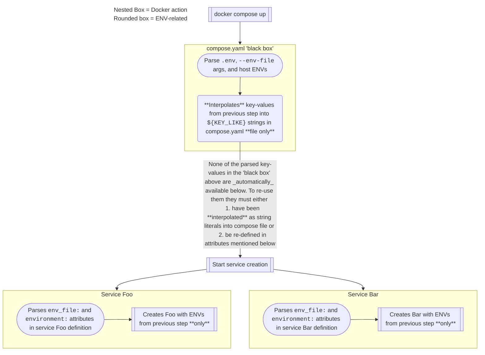

```mermaid
flowchart TD

 Z@{ shape: text, label: "Nested Box = Docker action
 Rounded box = ENV-related" }

    A[[docker compose up]] --> dockerenv
    subgraph dockerenv [compose.yaml 'black box']
    Par(["Parse <code>.env</code>, <code>--env-file</code> args, and host ENVs"]) --> B("**Interpolates** key-values from previous step into <code>${KEY_LIKE}</code> strings in compose.yaml **file only**")
    end
    B -->|"None of the parsed key-values in the 'black box' above are _automatically_ available below. To re-use them they must either 
    1. have been **interpolated** as string literals into compose file or 
    2. be re-defined in attributes mentioned below"| C
    C[[Start service creation]] --> servicefoo
    C --> servicebar
    subgraph servicefoo [Service Foo]
    fooenv(["Parses <code>env_file:</code> and <code>environment:</code> attributes in service Foo definition"]) --> D[[Creates Foo with ENVs from previous step **only**]]
    end
    subgraph servicebar [Service Bar]
    barenv(["Parses <code>env_file:</code> and <code>environment:</code> attributes in service Bar definition"]) --> barser[[Creates Bar with ENVs from previous step **only**]]
    end
```