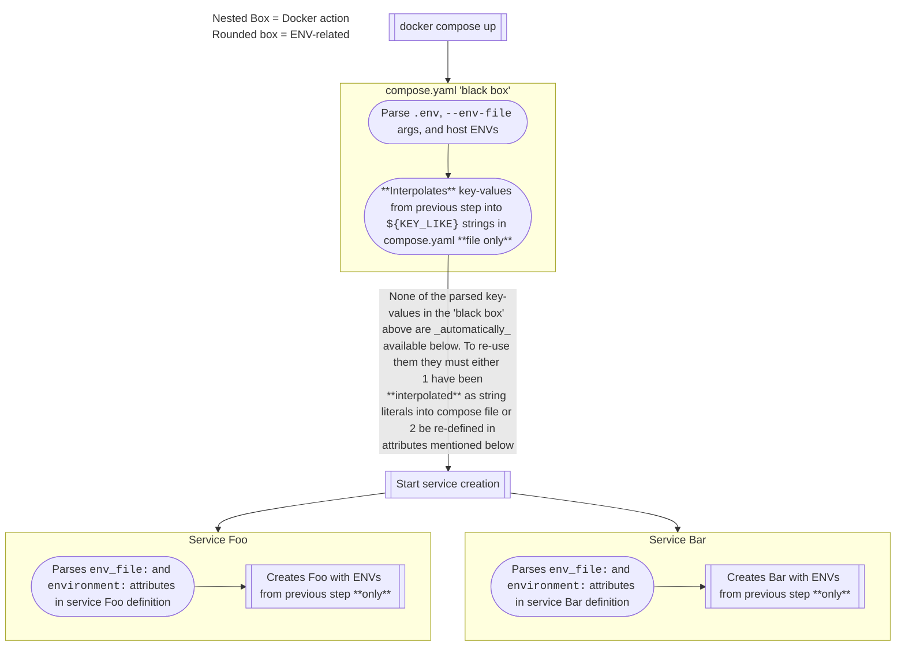
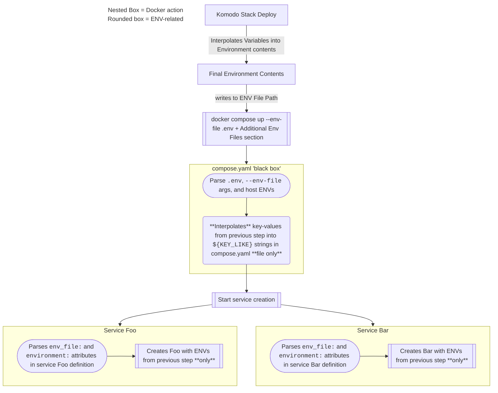

This guide aims to clear up any ambiguity around how Docker Compose handles environmental variables for its own configuration (`compose.yaml`) and providing ENVs to services.

**The key takeaway is that, even though these args/attributes all use the term `env` they are NOT all related to each other: `.env` `--env-file` `env_file:` and `environment:`.**

> **Practical Examples** of the scenarios found below can be found and run from [https://github.com/FoxxMD/compose-env-interpolation-example](https://github.com/FoxxMD/compose-env-interpolation-example)
{: .prompt-tip }

## Compose Up Flow

Let's start at a high level by describing the different steps Compose takes when `up`ing a stack so that we can see where the disconnect between all of these features takes place.



Much of the confusion regarding what ENVs are passed to containers stems from a user mistakenly believing that the functionality associated with `.env` and `--env-file` applies to containers, when *by default* it only applies to the literal contents of `compose.yaml`.

As noted in the flow above, all of the ENV key-values we parsed from `.env`/`--env-file` for use in [`compose.yaml` variable interpolation](https://docs.docker.com/compose/how-tos/environment-variables/variable-interpolation) are not automatically passed to any created services. They can still be used but to do this we must explicitly define this **again** in each our service definitions.

To reiterate **because this is the most important point:** Think of each "parent" box in the flow above as an isolated process that does not know about anything happening in the other boxes. `.env`/`--env-file` apply **only** to the *literal string contents* of `compose.yaml`. Each service cares **only** about its own `env_file:`/`environment:`

## ENV Parsing

Now, we will cover how each "part" of the above flow actually handles the functionality for parsing/interplating ENVs.

### Interpolating into `compose.yaml`

When `docker compose up` is run, docker

* parses host environmental variables and `.env`/`--env-file` into a list of key-values
* these key-values are then used these to [interpolate (subtitute)](https://docs.docker.com/compose/how-tos/environment-variables/variable-interpolation/#interpolation-syntax) `${KEY_LIKE}` strings into values **only in the literal string contents of `compose.yaml`**.

The order of operations for using these two sources of key-values:

* When no `--env-file` arg is given to `compose up` then docker uses a [`.env` file](https://docs.docker.com/compose/how-tos/environment-variables/variable-interpolation/#env-file) located next to `compose.yaml`, if one is present.
* If an [`--env-file`](https://docs.docker.com/compose/how-tos/environment-variables/variable-interpolation/#substitute-with---env-file) arg is given then it uses that **instead of `.env`**
  * Multiple `--env-file` args can be used to provide multiple files
  * To use both `.env` and `--env-file` simply add `--env-file .env`

### Providing ENVs to Containers/Services

In **each service** in `compose.yaml` environmental variables need to be **explicitly defined**. None of the key-values we parsed in the above section are automatically passed.

To define what ENVs the service will have access to we can use:

* `environment:` list with key-values like `MY_KEY: myVal`
* and/or `env_file:` attribute where you can define a file (or list of files) with key-values that are all loaded into the service

Both of these can be used but be aware there is an [order or precedence](https://docs.docker.com/compose/how-tos/environment-variables/envvars-precedence/#how-the-table-works) if the same key is defined more than one place.

Additionally, the same files used for `.env`/`--env-file` can be used for `env_file:` **BUT they must be explicitly defined!** To spell this out:

If you want 

```
MY_VAR=xyz
```
{: file='test.env'}

To be available to both `compose.yaml` AND the `serviceA` container defined in the stack then you must:
 
`docker compose up --env-file test.env` AND

```yaml
services:
  serviceA:
    env_file: test.env
  # ...
```

## Examples

The below examples can all be run using the repository [https://github.com/FoxxMD/compose-env-interpolation-example](https://github.com/FoxxMD/compose-env-interpolation-example) which has all the compose/env files provided.

When a container is run from our sample image (used for the examples below and available in the repository) it runs a single command that prints ENVs available in the container:

```
echo "This is a variable: $FOO $BAR $HARD"
```

### `compose.yaml` with `.env` {#compose-with-dot-env}

Interpolate key-values from `.env` into a compose file. No environmental variables are passed to the service.

<details markdown="1">

```yaml
services:
  test:
    build:
      context: .
```
{: file='compose.yaml'}

```
FOO=aSecret
```
{: file='.env'}

```shell
docker compose up
```

Output is 

```
This is a variable:
```
{: file='Container output'}


* Compose file does not define any env attributes for the service so nothing from `.env` is inserted into container

</details>

### `environment:` in service

#### With default `.env`

Interpolate key-values from `.env` into a compose file. Environmentable variables are passed to the service using `environment:` where some come from interpolated `.env`

<details markdown="1">

```yaml
services:
  test:
    build:
      context: .
    environment:
      FOO: ${FOO}
      BAR: ${BAR}
      HARD: alwaysHere
```
{: file='compose-environment.yaml'}

```
FOO=aSecret
```
{: file='.env'}

```shell
docker compose -f compose-environment.yaml up
```

Output is 

```
This is a variable: aSecret alwaysHere
```
{: file='Container output'}


* Uses `.env` for Compose file since no other `--env-file` args
* Compose file has `environment:` where...
   * `FOO` (container ENV) is set to `${FOO}` from `.env`
   * `HARD` (container ENV) is hardcoded to `alwaysHere` in compose file

</details>

#### Using explicit `add.env`

Interpolate key-values from `add.env` into a compose file. Environmentable variables are passed to the service using `environment:` where some come from interpolated `add.env`

<details markdown="1">

```yaml
services:
  test:
    build:
      context: .
    environment:
      FOO: ${FOO}
      BAR: ${BAR}
      HARD: alwaysHere
```
{: file='compose-environment.yaml'}

```
BAR=someBar
```
{: file='add.env'}


```shell
docker compose -f compose-environment.yaml --env-file add.env up
```

Output is 

```
This is a variable: someBar alwaysHere
```
{: file='Container output'}

* Uses `add.env` for Compose file because of `--env-file` args
  * Does NOT use `.env` because `--env-file` is given 
* Compose file has `environment:` where...
   * `BAR` (container ENV) is set to `${BAR}` from `add.env`
   * `HARD` (container ENV) is hardcoded to `alwaysHere` in compose file

</details>

#### Using multiple explicit env files

Interpolate key-values from `add.env` into a compose file. Environmentable variables are passed to the service using `environment:` where some come from interpolated `add.env`

<details markdown="1">

```yaml
services:
  test:
    build:
      context: .
    environment:
      FOO: ${FOO}
      BAR: ${BAR}
      HARD: alwaysHere
```
{: file='compose-environment.yaml'}

```
FOO=aSecret
```
{: file='.env'}
```
BAR=someBar
```
{: file='add.env'}

```shell
docker compose -f compose-environment.yaml --env-file add.env --env-file .env up
```

Output is 

```
This is a variable: aSecret someBar alwaysHere
```
{: file='Container output'}

* Uses `add.env` for Compose file because of `--env-file` arg
* Uses `.env` for Compose file because of `--env-file` arg
* Compose file has `environment:` where...
   * `FOO` (container ENV) is set to `${FOO}` from `.env`
   * `BAR` (container ENV) is set to `${BAR}` from `add.env`
   * `HARD` (container ENV) is hardcoded to `alwaysHere` in compose file

</details>

### Using `env_file:` in service {#ex-env-file-in-service}

Uses [`env_file:`](https://docs.docker.com/compose/how-tos/environment-variables/set-environment-variables/#use-the-env_file-attribute) to load all key-values found in the given file into the service's container. 

> Compare this to the [`compose.yaml` with `.env` example](#compose-with-dot-env)
{: .prompt-tip }

<details markdown="1">

```yaml
services:
  test:
    build:
      context: .
    env_file: .env
```
{: file='compose-envfile.yaml'}

```
FOO=aSecret
```
{: file='.env'}

```shell
docker compose -f compose-envfile.yaml up
```

Output is 

```
This is a variable: aSecret
```
{: file='Container output'}

* Uses `.env` for Compose file since no other `--env-file` args
* Compose file has `env_file:` which inserts everything found in the attribute value (`.env`) into the container

</details>

### Using `.env` for general variable interpolation

This guide and examples have so far focused on using `.env` for interpolating environmental variables into containers but [interpolation can be used *anywhere*](https://docs.docker.com/compose/how-tos/environment-variables/variable-interpolation) in `compose.yaml`.

This example interpolates `.env` key-values into `${VERSION}` to define what tag to use for a theoretical image.

<details markdown="1">

```yaml
services:
  test:
    image: myFakeImage:${VERSION}
```
{: file='compose.yaml'}

```
VERSION=v1.2.3
```
{: file='.env'}

```shell
docker compose up
```

The **interpolated** `compose.yaml` contents

```yaml
services:
  test:
    image: myFakeImage:v1.2.3
```
{: file='compose.yaml'}

* Uses `.env` for Compose file since no other `--env-file` args
* `${VERSION}` is substituted for `v1.2.3` found in `.env`
  * `VERSION` is NOT passed to the service `test` since no env attributes are defined

</details>

## Komodo and ENVs

> Not familiar with Komodo? Check out my [Introduction to Komodo](../migrating-to-komodo) and [FAQ](../komodo-tips-tricks).
{: .prompt-tip }

[Komodo](https://komo.do/) adds one more layer to this process that occurs **before `docker compose up`**.

Komodo takes the contents of the **Environment** section in your Komodo Stack and:

* Interpolates any [Variables](https://komo.do/docs/variables) into the contents like `[[MY_VAR]]`
* The final content is written to the file specified by **Env File Path** in your Stack (defaults to `.env`)
  * The file specified by Env File Path is the **ONLY** file that Variable interpolation occurs in

After this is done it then runs `docker compose up --env-file .env` and includes any additional files you specified in the **Additional Env Files** section of your stack.

<details markdown="1">

<summary>Variables Example</summary>

Assume you have this [**Variable**](https://komo.do/docs/variables) already in Komodo (in Settings -> Variables)

* `MY_SECRET_1` : `aCoolSecret`

And your **Stack** config looks like this:

```
MY_NORMAL_ENV=abc
MY_API_KEY=[[MY_SECRET_1]]
```
{: file='Stack Environment Section'}

```yaml
services:
  test:
    image: myFakeImage
  environment:
    AN_ENV: ${MY_NORMAL_ENV}
    API: ${MY_API_KEY}
```
{: file='compose.yaml'}

The **interpolated** `compose.yaml` will look like:


```yaml
services:
  test:
    image: myFakeImage
  environment:
    AN_ENV: abc
    API: aCoolSecret
```
{: file='compose.yaml'}

The different names for all the keys in the above example are to help convey that each "section" needs to have keys defined, they aren't automatically passed. Though you CAN pass them from Komodo **Environment** section straight to container by using [`env_file:`](#ex-env-file-in-service) like `env_file: .env`

</details>

<details markdown="1">

<summary>Komodo Compose Up Flow</summary>



</details>