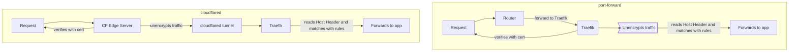

I recently refactored my homelab (60+ stacks, 100+ containers, 6+ machines) from using NGINX/[SWAG](https://docs.linuxserver.io/general/swag/) for reverse proxy to [Traefik](https://traefik.io/).

This post is:

* 1/3 context/explanation for why
* 1/3 guide with examples for migrating a non-trivial NGINX setup (Authentik, Crowdsec, realtime log viewing, scaling, network isolation)
* 1/3 "How-To" and FAQ for problems I couldn't find easy solutions to elsewhere on the internet

> [There is a companion repository with full, docker compose stack examples for everything in this guide.](https://github.com/FoxxMD/traefik-homelab)
{: .prompt-tip}

## Background

### Why?

#### NGINX Configuration is Static

This is the single most important reason I had for migrating away from NGINX. 

In a homelab environment where services are being spun up/down, created, moved between hosts, renamed, etc...having to 1) remember to update NGINX config and then restart it and 2) keep track of IP:PORT or specific config per application is a pain. NGINX was designed during a time when network topology wasn't so dynamic, so it's not built with a homelab use-case in mind. It's also not built with today's paradigms in mind, such as [first-class environmental substitution](https://www.baeldung.com/linux/nginx-config-environment-variables) or [easy-to-read config validation.](https://github.com/dvershinin/gixy)

#### NGINX Service Configuration Ownership

As my homelab continues to grow I have gravitated towards each Stack owning its own configuration. Through mechanisms like `environment` in `compose.yaml` or configs committed to git alongside `compose.yaml` etc., having the service-as-code [live next to all the data needed run the service](#dynamic-label) makes it more portable and reduces the cognitive scope required to configure it. NGINX config files need to be physically accessible to it and that is not a *feasible* option when services run on other hosts.

#### SWAG is Tightly Coupled and Opinionated

LSIO does an excellent job making setup with NGINX easy by using [SWAG](https://docs.linuxserver.io/general/swag/). For simple setups and users just dipping their toes into the space it's a fantastic tool for getting started quickly without requiring any hand-holding.

However, it has shortfalls which appear for more complex use-cases. Some of these are limitations of nginx, such as needing the user to [edit .ini files for DNS ACME challenge, while other solutions only need ENVs](#wildcards).

Others are due to the reality of limited developer-hours needing to fulfill only the most common use-case, like LSIO's [cloudflare docker mod](https://github.com/linuxserver/docker-mods/tree/universal-cloudflared) configuration only working with one domain even though a tunnel can be used for multiple domains -- one domain is the most common use-case and easiest to script for. In this scenario, "fixing" the problem means refactoring the entire stack to remove universal-cloudflare and implementing your own `cloudflared` container.

If most scenarios end with the user having to implement the decoupled solution anyway...why not consider other reverse proxy solutions since we aren't tied to SWAG anymore?

#### SWAG Cert Management Feels Bad

I'll admit this is entirely personal opinion. SWAG has two ENVs used for configuring a cert *for a first domain:* `URL` and `SUBDOMAINS`.

```yaml
environment:
  URL: yourdomain.url
  SUBDOMAINS: www,example1,example2
```
{: file="compose.yaml"}

To add additional domains (with their subdomains) you need to use a third ENV that combines both in away that you would have assumed the original ENVs could have been used:

```diff
environment:
  URL: yourdomain.url
  SUBDOMAINS: www,example1,example2
+ EXTRA_DOMAINS: yourdomainfoo.url,yourdomainbar.url,sub1.yourdomainbar.url
```
{: file="compose.yaml"}

Why isn't the syntax for `EXTRA_DOMAINS` the way "everything" works? I imagine it's a backward compatibility thing but it rubs me the wrong way.

Additionally, to change this generating a wildcard cert all of the ENVs need to change...again.

```diff
environment:
  URL: yourdomain.url
- SUBDOMAINS: www,example1,example2
+ SUBDOMAINS: wildcard
- EXTRA_DOMAINS: yourdomainfoo.url,yourdomainbar.url
+ EXTRA_DOMAINS: yourdomainfoo.url,*.yourdomainfoo.url,yourdomainbar.url,*.yourdomainbar.url
```
{: file="compose.yaml"}

It's not exactly *complex* but it definitely isn't intuitive either. Compare this to how [Traefik does it, either automatically or with idiomatic YAML config.](#cert-management) 

Traefik also has the advantange of being able to configure [DNS challenge provider via ENV](#wildcards) while SWAG requires finding an [`.ini` file](https://github.com/linuxserver/docker-swag/tree/master/root/defaults/dns-conf) in the SWAG service's [config directory](https://docs.linuxserver.io/general/swag/#docker-compose), and then [editing the file to hardcode our DNS provider's credentials.](https://github.com/linuxserver/docker-swag/blob/master/root/defaults/dns-conf/cloudflare.ini)

#### Lack of Dashboard

NGINX does not have a dashboard unless you are paying for enterpise (NGINX Plus). SWAG has a [docker mod for Goaccess](https://github.com/linuxserver/docker-mods/tree/swag-dashboard) but that is more traffic-focused then NGINX config-related. [NPM does have a dashboard](https://nginxproxymanager.com/screenshots/) as does [Traefik](https://doc.traefik.io/traefik/operations/dashboard/).

Having a dashboard with relevant config metrics and error troubleshooting becomes a must as the number of services served grows.

#### NGINX/SWAG does not have first-class Service Discovery

SWAG offers the docker mod [swag-auto-proxy](https://github.com/linuxserver/docker-mods/tree/swag-auto-proxy) which generates nginx confs for services discovered by docker label on the same machine NGINX is running on. I forked this as [swag-auto-proxy-multi](https://github.com/FoxxMD/docker-mods/tree/swag-auto-proxy-multi) and wrote new functionality to enable it to work with multiple hosts using [docker-socket-proxy](https://docs.linuxserver.io/images/docker-socket-proxy/). 

While this does work, it's not *good.* The inner workings are a mess of bash scripts that generate nginx confs and reload *the entire application* every time new changes are made. It's also barebones compared to applications like Traefik that have [service discovery as a first-class feature.](https://traefik.io/glossary/service-discovery/)

### Requirements/Spec

Before YOLO'ing another reverse-proxy solution I came up with a list of requirements that needed to met. I have 60+ stacks, over 100 containers, running on 7 machines. 

If I am going to switch and do all the work to get most of these served, then the new solution was going to have to 1) have **feature parity** with SWAG + features I use with it (auth) and 2) be **easier** to implement with all my machines than the current swag + auto-proxy setup.

The requirements:

* Must be able to host services with web routing parity WRT NGINX configs
* Cert management must be easier than SWAG
  * Must be able to validate via dns challenge
  * Must be able to validate multiple domains with wildcard subdomains
* Must be able to integrate crowdsec
* Must be able to integrate with cloudflare tunnels
* Must be able to integrate with authentik
* Service discovery must be easier 
  * Must be feasible without Swarm/changing current docker topology (5+ hosts)
* Must be able to separate internal/external services

### Evaluating Other Solutions

* [NGINX Proxy Manager (NPM)](https://nginxproxymanager.com)
  * Considered since almost all my confs would be able to stay the same
  * Eventually decided against due to lack of first-class service discovery
* [Caddy](https://caddyserver.com/)
  * Requires third party module for [service discovery](https://github.com/lucaslorentz/caddy-docker-proxy)
  * [Plugins require custom builds](https://github.com/serfriz/caddy-custom-builds) including cloudflare/crowdsec
* [GoDoxy](https://github.com/yusing/godoxy)
  * Has dashboard, dynamic reloading, automatic certs
  * Has first-class docker service discovery via labels and supports [multiple hosts](https://github.com/yusing/godoxy/wiki/Configurations#setting-up-providers)
  * Strongly considered but too new...lack of docs and user base. My homelab is too large and in "production use" to be a beta tester

## Satisfying Requirements with Traefik

I eventually settled on [Traefik](https://traefik.io/) after due-diligence gave me enough confidence to think I could satisfy all of the [Requirements](#requirementsspec).

The actual implementation is always more difficult than how it looks on paper, but in the end, it met every requirement and ended up being easy to maintain and work with! 

In each section below I lightly cover the differences between SWAG/Traefik, what was needed to migrate to Traefik, and how I implemented it along with examples, if necessary.

### Web Routing Parity

This was the hardest requirement to meet for **edge cases**. Unlike NGINX,

* Doing anything that short-circuits a route and isn't already a middleware isn't well documented
* Traefik doesn't have as many middlewares (plugins) and well-documented, non-trivial "how to do X" examples
* Traefik's docs mostly use file provider examples which have 1-to-1 equivalents in [docker provider labels](https://doc.traefik.io/traefik/providers/docker/#configuration-examples) but labels examples are basically non-existent. Tracking down examples of *complex* labels usage was frustrating.

Despite more complex Nginx confs requiring more work to emulate with Traefik, **the majority of SWAG's subdomain confs are straightforward and can be replicated with only a few lines/labels in Traefik.**

Below is a sample SWAG `.conf` of an nginx `server` directive for sonarr, which is representative of the "basic" SWAG subdomain conf and covers ~90% of use cases.

<details markdown="1">

<summary>Expand Full Sample</summary>

[`dozzle.subdomain.conf.sample`](https://github.com/linuxserver/reverse-proxy-confs/blob/4d3e03f6dcfc69734755ac80b9d765938646bacc/dozzle.subdomain.conf.sample) from [https://github.com/linuxserver/reverse-proxy-confs](https://github.com/linuxserver/reverse-proxy-confs)

```nginx
## Version 2024/07/16
# make sure that your dozzle container is named dozzle
# make sure that your dns has a cname set for dozzle

server {
    listen 443 ssl;
    listen [::]:443 ssl;

    server_name dozzle.*;

    include /config/nginx/ssl.conf;

    client_max_body_size 0;

    # enable for ldap auth (requires ldap-location.conf in the location block)
    #include /config/nginx/ldap-server.conf;

    # enable for Authelia (requires authelia-location.conf in the location block)
    #include /config/nginx/authelia-server.conf;

    # enable for Authentik (requires authentik-location.conf in the location block)
    #include /config/nginx/authentik-server.conf;

    location / {
        # enable the next two lines for http auth
        #auth_basic "Restricted";
        #auth_basic_user_file /config/nginx/.htpasswd;

        # enable for ldap auth (requires ldap-server.conf in the server block)
        #include /config/nginx/ldap-location.conf;

        # enable for Authelia (requires authelia-server.conf in the server block)
        #include /config/nginx/authelia-location.conf;

        # enable for Authentik (requires authentik-server.conf in the server block)
        #include /config/nginx/authentik-location.conf;

        include /config/nginx/proxy.conf;
        include /config/nginx/resolver.conf;
        set $upstream_app dozzle;
        set $upstream_port 8080;
        set $upstream_proto http;
        proxy_pass $upstream_proto://$upstream_app:$upstream_port;

    }
}
```
{: file="dozzle.subdomain.conf.sample"}

</details>

I'll break down the directive parts and how to they match up to Traefik functionality.

```nginx
listen 443 ssl;
listen [::]:443 ssl;

# ...

include /config/nginx/ssl.conf;
```
{: file="dozzle.subdomain.conf.sample"}

Traefik [Entrypoint](https://doc.traefik.io/traefik/routing/entrypoints) with [HTTPS/TLS](https://doc.traefik.io/traefik/https/overview/) using [ACME provider for automatic certs](https://doc.traefik.io/traefik/https/acme/) or certificate resolvers [(covered below)](#cert-management) for statically-defined domains.


```nginx
server_name dozzle.*;
```
{: file="dozzle.subdomain.conf.sample"}

Using [Router](https://doc.traefik.io/traefik/routing/routers/) [Rules](https://doc.traefik.io/traefik/routing/routers/#rule) like [Host](https://doc.traefik.io/traefik/routing/routers/#host-and-hostregexp) to match domains. This can be done in a [dynamic config file](#dynamic-file) but is more often seen as a [label on a docker compose service](https://doc.traefik.io/traefik/providers/docker/#configuration-examples) like this:

```yaml
services:
  dozzle:
    # ...
    labels:
      - traefik.http.routers.dozzle.rule=Host(`dozzle.tld`)
```
{: file="compose.yaml"}

```nginx
    # enable for ldap auth (requires ldap-location.conf in the location block)
    #include /config/nginx/ldap-server.conf;

    # enable for Authelia (requires authelia-location.conf in the location block)
    #include /config/nginx/authelia-server.conf;

    # enable for Authentik (requires authentik-location.conf in the location block)
    #include /config/nginx/authentik-server.conf;

    location / {
        # enable the next two lines for http auth
        #auth_basic "Restricted";
        #auth_basic_user_file /config/nginx/.htpasswd;

        # enable for ldap auth (requires ldap-server.conf in the server block)
        #include /config/nginx/ldap-location.conf;

        # enable for Authelia (requires authelia-server.conf in the server block)
        #include /config/nginx/authelia-location.conf;

        # enable for Authentik (requires authentik-server.conf in the server block)
        #include /config/nginx/authentik-location.conf;
    # ...
```
{: file="dozzle.subdomain.conf.sample"}

These are the equivalent to Traefik [Middleware](https://doc.traefik.io/traefik/middlewares/overview/) that would be defined either

* for all routes on the entrypoint
* for specific routes using docker labels like:

```yaml
services:
  dozzle:
    # ...
    labels:
      - traefik.http.routers.dozzle.rule=Host(`dozzle.tld`)
      - traefik.http.routers.dozzle.middleware=authentik@file
      # ...
```
{: file="compose.yaml"}

I cover setting up [Authentik with Traefik](#authentik-integration) below.


```nginx
        include /config/nginx/proxy.conf;
        include /config/nginx/resolver.conf;
        set $upstream_app dozzle;
        set $upstream_port 8080;
        set $upstream_proto http;
        proxy_pass $upstream_proto://$upstream_app:$upstream_port;
```
{: file="dozzle.subdomain.conf.sample"}

The Traefik equivalent of this is [Services](https://doc.traefik.io/traefik/routing/services/).

This can be configured for non-docker sources using a [dynamic config file](#dynamic-file) or, more commonly, on the docker compose service using a label. When using labels usually only the port is necessary as the [Docker Provider](https://doc.traefik.io/traefik/providers/docker/) takes care of determining the IP/host to use.

```yaml
services:
  dozzle:
    # ...
    labels:
      - traefik.http.routers.dozzle.rule=Host(`dozzle.tld`)
      - traefik.http.services.dozzle.loadbalancer.server.port: 8080
      # ...
```
{: file="compose.yaml"}

More information on [Service Discovery and Docker is covered below.](#service-discovery)


#### How do I do X?

Check the [FAQ](#faq) at the bottom for more examples like

* [Redirect on non-existent Route](#redirect-on-non-existent-route)
* [Multiple domains, same container](#multiple-services-same-container)

### Cert Management

Both SWAG and Traefik offer automated SSL cert generation but I found Traefik's setup to be vastly easier to understand and configure [than SWAGs.](#swag-cert-management-feels-bad)

For a simple setup, say one domain + subdomain using *http verification*, both providers are moderately equivalent. SWAG does everything using [container ENVs](https://docs.linuxserver.io/general/swag/#create-container-via-http-validation) which is attractive.

Traefik requires setting up a [cert resolver and entrypoint](https://doc.traefik.io/traefik/https/acme/#configuration-examples) which can be done via file or as labels on a docker container (not recommended).

One advantage Traefik has is that it will [automatically generate certs](https://doc.traefik.io/traefik/https/acme/#domain-definition) for **all domains** found during service discovery (that is, if you have the label)

```yaml
labels:
  - traefik.http.routers.blog.rule=Host(`example.com`) && Path(`/blog`)
```
{: file="compose.yaml"}

on a docker container then Traefik will automatically get a cert for `example.com`. That's pretty nice. 

#### Wildcards

This is where Traefik really shines. To use wildcard certs with Traefik, we add a few more lines to our existing [static config](#static-file), specifying the dns challenge provider and explicitly defining the domains:

```diff
entryPoints
  websecure:
    asDefault: true
    address: :443
    http:
      tls:
        certResolver: myresolver
+        domains:
+          - main: foo.com
+            sans: 
+              - "*.foo.com"
+          - main: bar.com
+            sans:
+              - "*.bar.com"
# ...
certificatesResolvers:
  myresolver:
    acme:
      email: "info@foo.com"
      storage: "/letsencrypt/acme.json"
-      httpChallenge:
-        entryPoint: web
+      dnsChallenge:
+        provider: cloudflare
```
{: file="/etc/traefik/traefik.yaml" link="https://github.com/FoxxMD/traefik-homelab/blob/main/traefik_internal/traefik/static_config/traefik.yaml#L64-L65"}

and then add to our traefik service whatever ENVs are required to fulfill the [DNS provider's config](https://doc.traefik.io/traefik/https/acme/#providers):

```diff
services:
  traefik:
    # ...
    environment:
      FOO: BAR
+      CF_DNS_API_TOKEN: ${CF_DNS_API_TOKEN}
```
{: file="compose.yaml" link="https://github.com/FoxxMD/traefik-homelab/blob/main/traefik_internal/compose.yaml#L14"}

And that's it! Compare this to the [wildcard setup required for SWAG](#swag-cert-management-feels-bad)...Traefik feels easier.

#### Cloudflare Tunnels {#certs-and-cf-tunnels}

When using [Cloudflare Tunnels](https://developers.cloudflare.com/cloudflare-one/connections/connect-networks/), no cert generation/management is required. 

<details markdown="1">

<summary>Why?</summary>

Traefik does not need (or use) certs to handle the traffic coming from `cloudflared` because the traffic from the tunnel is unencrypted by the time it is forwarded to Traefik.

The point of encryption/https/ssl for web traffic is to transport data between the requester's machine and your target network/endpoint in a way that cannot be modified or snooped on by a third party.

When traffic is routed directly from the internet to Traefik (using plain ol' port forwarding or w/e through your router) the burden of providing proof that the endpoint (your machine's IP) is the **owner** of `example.com` (and the encryption key) is on Traefik. Traefik uses letsencrypt/acme to provide that proof and generate certs *on your machine* that the requester can inspect to verify that chain. TLS/encryption for the request terminates when it reaches Traefik.

When using cloudflare tunnels, cloudflare is now the **owner** of that burden of proof (`example.com`). CF generates edge certs that the requester verifies for proof. It also modifies A/CNAME records to point to a *Cloudflare IP* instead of your network's public IP.

The requester then sends their traffic *to the Cloudflare IP*. This is where TLS/encryption terminates. CF then forwards the traffic to the associated `cloudflared` tunnel which then forwards it to whereever you configured it. You (Traefik) aren't necessary in that chain of proof anymore.

Below is a (very) simplied flowchart showing the difference between these two traffic flows.




> Traffic is encrypted between CF edge servers and CF Tunnel, but it's internal encryption that is unencrypted before `cloudflared` forwards it to your specified Service URL.
{: .prompt-info }

> The above explanation applies to **any** web server behind `cloudflared` -- NPM, Nginx, Caddy, etc...
{: .prompt-info }

___

</details>

The Entrypoint setup for Traefik is slightly different (no `http.tls.certResolver` and address is different). See [Cloudflare Tunnel Integration](#cloudflare-tunnels-integration) below.

### Crowdsec Integration

Configuring Traefik to use [Crowdsec](https://www.crowdsec.net/) (CS) as a bouncer within Traefik is similar to SWAG but the actual setup of CS (containers, acquisition) is different.

How SWAG does it:

* [LSIO blog post on standing up a CS instance configured for Nginx/SWAG](https://www.linuxserver.io/blog/blocking-malicious-connections-with-crowdsec-and-swag)
* [LSIO docker mod `swag-crowdsec`](https://github.com/linuxserver/docker-mods/tree/swag-crowdsec) installs crowdsec lua module for use in nginx

How traefik does it:

* Given an existing crowdsec instance, traefik uses a [plugin](https://doc.traefik.io/traefik/plugins/) [maxlerebourg/crowdsec-bouncer-traefik-plugin](https://github.com/maxlerebourg/crowdsec-bouncer-traefik-plugin) that implements a [bouncer](https://docs.crowdsec.net/u/user_guides/bouncers_configuration/) that can be used as a middleware

#### Crowdsec Architecture

My CS setup is *verbose*:

* Traefik container
  * Uses crowdsec-bouncer-plugin for middleware
  * Writes [access logs](https://doc.traefik.io/traefik/observability/access-logs/) to rotating log file using [vegardit/docker-traefik-logrotate](https://github.com/vegardit/docker-traefik-logrotate)
* Basic alpine container `tail`s access logs to output (referred to below as `log-tail`)
  * [docker-socket-proxy](https://docs.linuxserver.io/images/docker-socket-proxy/) is used to expose `tail` container over the network
* Crowdsec
  * [**Decision (Local API)**](https://docs.crowdsec.net/docs/next/concepts) instance of `crowdsecurity/crowdsec` docker image (referred to below as `crowdsec`)
    * Used by crowdsec-bouncer-plugin
  * [**Ingest (Log Processor)**](https://docs.crowdsec.net/docs/next/concepts) instance of `crowdsecurity/crowdsec` docker image (referred to below as `crowdsec-ingest`) configured as a [**child** log processor](https://www.crowdsec.net/blog/multi-server-setup)
    * Processes logs `log-tail` container and feeds decisions back to `crowdsec`

The majority of the above could be consolidated into one CS container, CS config, and your main traefik container. The reason it is broken out into so many components:

* Separating access logs from regular Traefik logs
  * Troubleshooting traefik-specific issues from logs is much easier (less noise in container logs)
  * Write to file persists the access logs after restart
* Exposing/using `log-tail` container enables
  * [traefik log acquistion](https://docs.crowdsec.net/docs/next/log_processor/data_sources/docker) to be done with a docker connection locally or remotely, and by container name. Instead of needing to mount log folders/files into a crowdsec container (locally only) and having to deal with permissions.
  * access logs are consumable/viewable in other apps (when using `json` access log format, readable in [Dozzle](https://dozzle.dev/) or Logdy)
* Separate Crowdsec LAPI/log processor instances:
  * In high-traffic environments log processing can be CPU intensive while bouncer-decision communication is relatively light
    * `crowdsec-ingest` can be deployed to a more powerful machine and its config is simplified compared to full LAPI config
    * `crowdsec` can be deployed to a lower power/more stable machine, or next to traefik
      * if `crowdsec-ingest` bottlenecks to high volume, or crashes, `crowdsec` will still operate and traefik will still get decisions

From real-world experience this setup scales *much better* than a single CS instance. Feel free to consolidate any of the below setup if this setup is too overkill for you, though.

#### Setup Access Logs {#access-logs}

Configure traefik to output access logs, make sure files are rotated, and expose logs as a docker container.

In your traefik [static config](#static-file) add:

```yaml
accessLog:
# Using custom json format to prevent buffering, drop headers, and keep user agent
  filePath: "/var/log/traefik/access.log"
  format: json
  # filters:
  #   statusCodes:
  #     - "200-299" # log successful http requests
  #     - "400-599" # log failed http requests
  # collect logs as in-memory buffer before writing into log file
  bufferingSize: 0
  fields:
    headers:
      defaultMode: drop # drop all headers per default
      names:
          User-Agent: keep # log user agent strings
```
{: file="/etc/traefik/traefik.yaml" link="https://github.com/FoxxMD/traefik-homelab/blob/main/traefik_external/traefik/static_config/traefik.yaml#L1"}


Make sure to mount the log dir to your host filesystem and then add the rest of the access log functionality to `compose.yaml`

```yaml
services:
  traefik:
  # ...
    volumes:
      # ...
      - ./traefik/log:/var/log/traefik:rw
    # ...

  logrotate:
    image: vegardit/traefik-logrotate:latest
    network_mode: none
    volumes:
      - /var/run/docker.sock:/var/run/docker.sock:rw # required to send USR1 signal to Traefik after log rotation
      - ./traefik/log:/var/log/traefik:rw # folder containing access.log file
    environment:
      TZ: "America/New_York"
      # all environment variables are optional and show the default values:
      LOGROTATE_LOGS: "/var/log/traefik/*.log" # log files to rotate, directory must match volume mount
      LOGROTATE_TRIGGER_INTERVAL: daily  # rotate daily, must be one of: daily, weekly, monthly, yearly
      LOGROTATE_TRIGGER_SIZE: 50M        # rotate if log file size reaches 50MB
      LOGROTATE_MAX_BACKUPS: 7          # keep 14 backup copies per rotated log file
      LOGROTATE_START_INDEX: 1           # first rotated file is called access.1.log
      LOGROTATE_FILE_MODE: 0644          # file mode of the rotated file
      LOGROTATE_FILE_USER: root          # owning user of the rotated file
      LOGROTATE_FILE_GROUP: root         # owning group of the rotated file
      CRON_SCHEDULE: "* * * * *"
      CRON_LOG_LEVEL: 8                  # see https://unix.stackexchange.com/a/414010/378036
      # command to determine the id of the container running Traefik:
      TRAEFIK_CONTAINER_ID_COMMAND: docker ps --no-trunc --quiet --filter label=org.opencontainers.image.title=Traefik
  tail-log:
    image: alpine
    # name that will be used in aquis.yaml
    container_name: tail-log
    volumes:
      - ./traefik/log:/var/log:ro
    command: >
      sh -c "tail -F /var/log/access.log"
    network_mode: none
    restart: unless-stopped
  socket-proxy:
    image: lscr.io/linuxserver/socket-proxy:latest
    container_name: socket-proxy
    environment:
      - CONTAINERS=1
      - POST=0
    volumes:
      - /var/run/docker.sock:/var/run/docker.sock:ro
    ports:
      - 2375:2375
    restart: always
    read_only: true
    tmpfs:
      - /run
```
{: file="traefik_external/compose.yaml" link="https://github.com/FoxxMD/traefik-homelab/blob/main/traefik_external/compose.yaml#L37"}

#### Setup Crowdsec Local API {#crowdsec-local-api}

```yaml
services:
  crowdsec:
    image: "crowdsecurity/crowdsec:latest"
    environment:
      - "CUSTOM_HOSTNAME=cs-decision"
      - "GID=1000"
      - "LEVEL_INFO=true"
      - "TZ=America/New_York"
    ports:
      - "4242:4242/tcp"
      - "6060:6060/tcp"
      - "8080:8080/tcp"
    restart: "always"
    volumes:
      - "./crowdsec/config:/etc/crowdsec"
      - "./crowdsec/data:/var/lib/crowdsec/data"
      - "./crowdsec/logs:/var/log/crowdsec"
      - /var/run/docker.sock:/var/run/docker.sock:ro
```
{: file="crowdsec/compose.yaml" link="https://github.com/FoxxMD/traefik-homelab/blob/main/crowdsec/compose.yaml#L2"}

Start the service and exec into the container.

```shell
docker container exec -it crowdsec-crowdsec-1 /bin/sh
```

Then, add a new **machine** so our child log processor can login.

```shell
cscli machines add MyChildMachine --auto
```

`MyChildMachine` is the username for the machine and the command will output a **LAPI password**. Save this for the next step.

Then, add a new bouncer that will be used with traefik.

```
cscli bouncers add MyBouncerName
```

This command will output a **bouncer key**. Save this for [traefik bouncer setup.](#traefik-bouncer-setup)

#### Setup Crowdsec Child Log Processor {#crowdsec-child-setup}

```yaml
  crowdsec-ingest:
    image: "crowdsecurity/crowdsec:latest"
    environment:
      - "COLLECTIONS=crowdsecurity/linux crowdsecurity/traefik crowdsecurity/whitelist-good-actors"
      # known to have false positives and is CPU intensive
      - "DISABLE_SCENARIOS=crowdsecurity/http-bad-user-agent"
      # improves regex performance
      - "CROWDSEC_FEATURE_RE2_GROK_SUPPORT=true"
      - "CUSTOM_HOSTNAME=cs-ingest"
      - "GID=1000"
      # important to make this a worker
      - "DISABLE_LOCAL_API=true"
      - "LEVEL_INFO=true"
      - "LOCAL_API_URL=http://CS_LAPI_INSTANCE_HOST_IP:8080"
    ports:
      - "6061:6060/tcp"
    restart: "always"
    volumes:
      - "./crowdsec-ingest/config:/etc/crowdsec"
      - "./crowdsec-ingest/data:/var/lib/crowdsec/data"
      - "./crowdsec-ingest/logs:/var/log/crowdsec"
```
{: file="crowdsec/compose.yaml" link="https://github.com/FoxxMD/traefik-homelab/blob/main/crowdsec/compose.yaml#L21"}

> This service can be added to the Local API stack above if they are running on the same machine
{: .prompt-tip }

Start the service to generate all of the default configuration files. Then stop the service and edit these files:

Set `api.server.enable: false` in `/etc/crowdsec/config.yaml`
```yaml
# ...
api:
  # ...
  server:
    # ...
    enable: false
```
{: file="/etc/crowdsec/config.yaml" }

Modify `local_api_credentials.yaml` to use the username/**LAPI password** we got in the [previous step.](#crowdsec-local-api)

```yaml
url: http://CROWDSEC_LOCAL_API_HOST:8080
login: MyChildMachine
password: 9W0Mtyh5lJ1Hks29BxN4arPKA06t264J8TvIh9Uxu1fyHAVGO22AcWNbx8Oh4tJ
```
{: file="/etc/crowdsec/local_api_credentials.yaml"}

Finally, modify `acquis.yaml` to add the docker data source for our `tail-log` container that is [streaming traefik access logs:](#access-logs)

```yaml
source: docker
container_name:
 - tail-log
docker_host: tcp://TRAEFIK_HOST_IP:2375
labels:
  type: traefik
  ```
{: file="/etc/crowdsec/acquis.yaml" link="https://github.com/FoxxMD/traefik-homelab/blob/main/crowdsec/crowdsec_ingest/config/acquis.yaml#L10"}

Now `crowdsec-ingest` can be restarted and should be processing traefik logs as well as reporting to CS Local API.

#### Setup Traefik Crowdsec Bouncer {#traefik-bouncer-setup}

Add the `crowdsec` service IP and **bouncer key**, [generated earlier](#crowdsec-local-api), to traefik as environmental variables.

```yaml
  traefik:
    image: "traefik:v3.3"
    # ...
    environment:
      # ...
      # better in .env or as secret
      CS_TRAEFIK_BOUNCER_KEY: o2siyq4Dt92N9sQCbiRVIHjXWstr5jIwU7Puhxws
      BOUNCER_HOST: CROWDSEC_LOCAL_API_HOST:PORT
```
{: file="traefik_external/compose.yaml" link="https://github.com/FoxxMD/traefik-homelab/blob/main/traefik_external/compose.yaml#L17-L18"}

Add the [crowdsec-bouncer-traefik-plugin](https://github.com/maxlerebourg/crowdsec-bouncer-traefik-plugin) to your traefik [static config file](#static-file).

```yaml
experimental:
  plugins:
    # ...
    csbouncer:
      moduleName: github.com/maxlerebourg/crowdsec-bouncer-traefik-plugin
      version: "v1.4.0"
```
{: file="/etc/traefik/traefik.yaml" link="https://github.com/FoxxMD/traefik-homelab/blob/main/traefik_external/traefik/static_config/traefik.yaml#L53-L55"}

Create a new middleware in your traefik [dynamic config](#dynamic-file) that configures the CS plugin. We use [go templating](https://doc.traefik.io/traefik/providers/file/#go-templating) to [get the ENVs](https://masterminds.github.io/sprig/os.html) we set in the compose service earlier.

```yaml
http:
  middlewares:
    # ...
    crowdsec:
      plugin:
        csbouncer:
          #logLevel: DEBUG
          enabled: true
          httpTimeoutSeconds: 2
          # ban page can be enabled by manually copying ban.html https://github.com/maxlerebourg/crowdsec-bouncer-traefik-plugin
          # to a directory accessible to traefik container
          #banHTMLFilePath: /config/ban.html
          crowdsecLapiKey: '{{ env "CS_TRAEFIK_BOUNCER_KEY" }}'
          crowdsecLapiScheme: http
          crowdsecLapiHost: '{{ env "BOUNCER_HOST" }}'
          # optional but necessary if using cloudflare dns proxy/tunnel
          forwardedHeadersTrustedIPs: 
            - 172.28.0.1/24 
          # skip bouncing if request is from this IP range   
          clientTrustedIPs: 
            - 192.168.0.0/24
```
{: file="/config/dynamic/global.yaml" link="https://github.com/FoxxMD/traefik-homelab/blob/main/traefik_external/traefik/dynamic_config/global.yml#L12-L26"}

Then, add the middleware `crowdsec@file` to [entrypoints](https://doc.traefik.io/traefik/routing/entrypoints/) to have it applied to all routes or add it to [specific routes.](https://doc.traefik.io/traefik/routing/routers/#middlewares)

Finally, restart traefik to have crowdsec enabled and in use!


### Cloudflare Tunnels Integration

CF Tunnels setup is markedly different than SWAG but functionally the same once set up.

For CF Tunnels with SWAG there are two [LSIO docker mods](https://docs.linuxserver.io/general/container-customization/#docker-mods) that are used:

* [`universal-cloudflared`](https://github.com/linuxserver/docker-mods/tree/universal-cloudflared) - Installs `cloudflared` directly into the SWAG container and uses `CF_*` ENVs to automate setup via CLI (or `CF_REMOTE_MANAGE_TOKEN` to pull config from CF dashboard)
* [`cloudflare_real-ip`](https://github.com/linuxserver/docker-mods/tree/swag-cloudflare-real-ip) - pulls CF edge server IPs into a list that Nginx can use. It also requires adding a few Nginx directives to your config in order to use this list to set real IP.

We can achieve the same as above, for Traefik, by setting up `cloudflared` as its own container and using a the [traefik plugin](https://doc.traefik.io/traefik/plugins/) [cloudflarewarp](https://github.com/PseudoResonance/cloudflarewarp) to parse CF edge server IPs.

#### `cloudflared` Tunnel Container Setup

My opinionated approach is to do all Tunnel config in the CF Dashboard. This makes compose setup easier and enables `cloudflared` to automatically check for and applies config changes from dashboard so no container restarts are needed.

First, acquire your tunnel token by [creating a tunnel](https://developers.cloudflare.com/cloudflare-one/connections/connect-networks/get-started/create-remote-tunnel/) or using **Refresh Token** from the tunnel Overview tab, if you didn't save it initially on creation.

Next, setup the `cloudflared` container in your traefik stack:

```yaml
services:
  traefik:
    image: "traefik:v3.3"
    networks:
      - traefik_internal
    volumes:
    # how i get dynamic/static configs into traefik, can do this however you want
      - ./traefik/static_config:/etc/traefik:rw
      - ./traefik/dynamic_config:/config/dynamic:rw    
    # ...  
  cloudflare_tunnel:
    image: cloudflare/cloudflared:2025.2.0
    networks:
      - traefik_internal
    restart: unless-stopped
    # configure tunnel in cloudflare dashboard and use token from dashboard to configure container
    command: tunnel run --token ${CF_TRAEFIK_TUNNEL_TOKEN}
networks:
  traefik_internal:
    driver: bridge
    ipam:
    # important to set this so cloudflare_tunnel always has correct subnet
    # for traefik to recognize as trusted IP range
      config:
        - subnet: 172.28.0.0/16
```
{: file="traefik_external/compose.yaml" link="https://github.com/FoxxMD/traefik-homelab/blob/main/traefik_external/compose.yaml#L81-L88"}

Setting up the `traefik_internal` network with a static subnet will be important for CF IP forwarding later.

#### Traefik CF Entrypoint

Now we need to 1) tell Traefik to accept CF Tunnel traffic on an [entrypoint](https://doc.traefik.io/traefik/routing/entrypoints/) and 2) tell CF Tunnel to forward traffic to that entrypoint.

In your traefik [static config](#static-file) configure an entrypoint with a port and [forwarded headers](https://doc.traefik.io/traefik/routing/entrypoints/#forwarded-headers) so traefik knows to use CF IP as "request from" IP, rather than the `cloudflared` container internal IP. We will then use this later to get the [actual "request from" IP.](#cf-real-ip-forwarding)

```yaml
providers:
  file:
    directory: /config/dynamic
    watch: true
entryPoints:
  cf:
    # address CF tunnel config is pointed to on traefik container
    address: :808
    # if this is the only entrypoint this needs to be true
    asDefault: true
    # this needs to be on the entrypoint you are using for cf tunneled services
    # must match traefik_internal network
    forwardedHeaders:
      trustedIPs:
        - 172.28.0.1/24
```
{: file="/etc/traefik/traefik.yaml" link="https://github.com/FoxxMD/traefik-homelab/blob/main/traefik_external/traefik/static_config/traefik.yaml#L36-L46"}

Then, setup your tunnel's **Public Hostname** entries with the service pointing to

```
http://traefik:808
```


_Domain and wildcard entries with service URL_

The domain `traefik` should be the same as whetever you have the *service name* of traefik as in your [compose stack.](#cloudflared-tunnel-container-setup)

> [Why does the Service use `http` and traefik entrypoint not use TLS/SSL/certs?](#certs-and-cf-tunnels)
{: .prompt-info }

#### CF Real IP Forwarding

Finally, we need to configure traefik to substitute the value of the header `Cf-Connecting-IP` CF Tunnel attaches to our traffic into the `X-Forwarded-For` header. This will ensure that logs/metrics and downstream applications see the IP of the actual origin host rather than CF's edge server IPs.

To do this we first install the [traefik plugin](https://doc.traefik.io/traefik/plugins/) [cloudflarewarp](https://github.com/PseudoResonance/cloudflarewarp) by defining it in our [static config](#static-file):

```yaml
# add this to the /etc/traefik/traefik.yaml example above
experimental:
  plugins:
    cloudflarewarp:
      moduleName: "github.com/PseudoResonance/cloudflarewarp"
      version: "v1.4.0"
```
{: file="/etc/traefik/traefik.yaml" link="https://github.com/FoxxMD/traefik-homelab/blob/main/traefik_external/traefik/static_config/traefik.yaml#L50-L52"}

Then, define a middleware that uses the plugin in a [dynamic config file.](#dynamic-file)

```yaml
http:
  middlewares:
    cloudflarewarp:
      plugin:
        cloudflarewarp:
          disableDefault: false
```
{: file="/config/dynamic/global.yaml" link="https://github.com/FoxxMD/traefik-homelab/blob/main/traefik_external/traefik/dynamic_config/global.yml#L7-L11"}

To use with the entrypoint we setup earlier in our static config add `entryPoints.cf.http.middlewares` with our `middleware@provider`:

```yaml
# ... building on previous static config
# ...
entryPoints:
  cf:
    # ...
    # will always run if service/router is using cf entrypoint
    # otherwise, this middleware can be ommited here and instead used per service/router as a middleware
     middlewares:
       - cloudflarewarp@file
   # ...
```
{: file="/etc/traefik/traefik.yaml" link="https://github.com/FoxxMD/traefik-homelab/blob/main/traefik_external/traefik/static_config/traefik.yaml#L41"}

Now traefik will the plugin to get a list of CP edge server IPs that can be trusted for Real IP. It will use this list to overwite `X-Real-IP` and `X-Forwarded-For` with an IP from the CF-Connecting-IP header.

### Authentik Integration

SWAG handles the majority of the configuration needed to use authentik with Nginx using [sample config files.](https://github.com/linuxserver/docker-swag/blob/master/root/defaults/nginx/authentik-server.conf.sample) It also assumes that you are using the [embedded outpost](https://docs.goauthentik.io/docs/add-secure-apps/outposts/embedded/) and use the [default outpost path.](https://github.com/linuxserver/docker-swag/blob/master/root/defaults/nginx/authentik-location.conf.sample)

Traefik has no such pre-configured configuration but Authentik does provide [guidance on setting it up](https://docs.goauthentik.io/docs/add-secure-apps/providers/proxy/server_traefik), which is relatively straight forward. My configuration is essentially the same as the just mentioned guide for `docker-compose` with a few key differences.

##### Where's Authentik?

The [guide](https://docs.goauthentik.io/docs/add-secure-apps/providers/proxy/server_traefik) defines `authentik-proxy` but doesn't mention you need an actual `authentik` service deployed as well -- you can't use *just* the proxy. This might be obvious for some but it's not clear from the docs. You should follow the [Docker Compose installation docs](https://docs.goauthentik.io/docs/install-config/install/docker-compose) and deploy the authentik [`docker-compose.yaml`](https://github.com/goauthentik/authentik/blob/main/docker-compose.yml) stack. **Then**, add the `authentik-proxy` service from the guide to that stack (or wherever you want to deploy it).

If you deploy `authentik-proxy` in the same stack as the authentik `server` service you can change these environmental variables in `authentik-proxy` to take advantage of the stack network/hostnames:

```diff
service:
  # ...
  authentik-proxy:
    image: ghcr.io/goauthentik/proxy:${AUTHENTIK_TAG:-2024.10.5}
    # ...
    environment:
-      AUTHENTIK_HOST: https://your-authentik.tld
+      AUTHENTIK_HOST: http://server:9000
-      AUTHENTIK_INSECURE: "false"
+      AUTHENTIK_INSECURE: "true"
      # ...  
```
{: file="authentik/compose.yaml" link="https://github.com/FoxxMD/traefik-homelab/blob/main/authentik/compose.yaml#L83-L84"}

#### Setting up Authentik Outpost/Proxy

`authentik-proxy` set up in the previous section **is an [outpost.](https://docs.goauthentik.io/docs/add-secure-apps/outposts/)** The terminology used by Traefik isn't very clear about this. You will need to configure Authentik to accept a new outpost before `authentik-proxy` will run correctly.

* Open your Authentik dashboard -> Admin Interface -> Applications -> Outposts
* **Create** a new Outpost
  * Type: `Proxy`
  * Integration: Select `---------` from the dropdown so that it is blank (DO NOT use a Docker-Service Connection)
  * Applications: Select at least one now. More can be added later
  * **Create**
* **View Deployment Info** on the newely created outpost 
  * **AUTHENTIK_TOKEN** -> copy token

Add the copied token to the `AUTHENTIK_TOKEN` environmental variable in your `authentik-proxy` compose file and then restart the proxy. It should now operate correctly and Authentik should have a green status in "Health and Version" on the outposts page.

From now on, use this new outpost for applications intead of the embedded outpost.

#### Configuring Traefik with Authentik

Finally, the easy part! In [Authentik's Traefik guide](https://docs.goauthentik.io/docs/add-secure-apps/providers/proxy/server_traefik) setup the authentik middleware using the **Standalone traefik** sample for `http.middlewares.authentik` in a [dyanamic file config](https://doc.traefik.io/traefik/providers/file/), which creates the middleware `authentik@file`.

Alternatively, if you included all the labels from the **docker-compose** sample for `authentik-proxy`, then it is already setup (`traefik.http.middlewares.authentik.forwardauth.*`) and can be used with the middleware `authentik-proxy@docker`.

### Service Discovery

Traefik offers first-class support for [Service Discovery](https://doc.traefik.io/traefik/providers/overview/) via [Docker](https://doc.traefik.io/traefik/providers/docker/), [Docker Swarm](https://doc.traefik.io/traefik/providers/swarm/), [Dynamic File](https://doc.traefik.io/traefik/providers/file/), and many others.

#### Nginx Equivalent

Traefik supports "discovery" of services in a manner similar to Nginx using the ["dynamic" file provider](#dynamic-file). These are plain yaml files where you write all the configuration necessary for traefik to connect to an upstream service. Where these files are located is defined in traefik's [static config](#static-file):

```yaml
providers:
  file:
    directory: "/config/dynamic"
```
{: file="/etc/traefik/traefik.yaml" link="https://github.com/FoxxMD/traefik-homelab/blob/main/traefik_internal/traefik/static_config/traefik.yaml#L31-L33" }

An example of a dynamic file:

```yaml
http:
  routers:
    foo:
      entryPoints:
      - web
      middlewares:
      - authentik@file
      service: foo
      rule: Host(`foo.example.com`)
  services:
    foo:
      loadBalancer:
        servers:
        - url: "http://192.168.1.110:8080/"
```
{: file="/config/dynamic/sites.yaml" }

Traefik hot-reloads these files once they are saved so your changes are applied immediately. 

There is no reason you *couldn't* use these for all of your services, even docker containers. **But you shouldn't**...since the files are hardcoded you can't take advantage of all the dynamic wiring traefik can do for Docker/Swarm. The dynamic file configs also end up being much more verbose for simple use cases.

Use dynamic files:

* to define [complex **Middlewares**](https://doc.traefik.io/traefik/middlewares/http/overview/) which can then be used in docker labels
* for upstream services that can't be automatically discovered by another provider (like a static site or other non-docker web server)

#### Docker Discovery

If you are migrating from Nginx then it's likely all of your services are on the same machine (Docker instance/daemon). If this is true and you do not plan on expanding to multiple hosts soon then using the [Docker Provider](https://doc.traefik.io/traefik/providers/docker/) is right for you. This provider uses `docker.sock` to enumerate all the containers on the **same machine as Traefik** and discover services based on container labels.

Read through the provider docs thoroughly as they cover everything you need for setup. A minimal example:

```yaml
providers:
  docker:
    endpoint: "unix:///var/run/docker.sock"
```
{: file="/etc/traefik/traefik.yaml" }

```diff
services:
  traefik:
+   volumes:
+     - /var/run/docker.sock:/var/run/docker.sock
```
{: file="traefik_internal/compose.yaml"}

```yaml
services:
  foo:
  # ...
    labels:
      traefik.enable: true
      traefik.http.routers.foo.rule: Host(`foox.example.com`)
      traefik.http.services.foo.loadbalancer.server.port: 8080
```
{: file="foo-compose.yaml"}

#### Multi-Host Docker Discovery

If you have multiple machines running Docker and want Traefik to route to all of them, you have a few choices.

##### Dynamic files and Docker Discovery {#multi-host-files}

Use [**Dynamic files**](#nginx-equivalent) if it's only one or two unchanging services. Using this approach as well as the [docker provider](#docker-discovery) for services on the same machine is *doable* if the "other host" services are exceptions/unchanging and can be reached over the bridge network (host IP:PORT).

##### Docker Swarm

If you are already using [Docker Swarm](https://docs.docker.com/engine/swarm/) for all of your services then you're golden (why are you reading this guide?). Setup the [Swarm provider](https://doc.traefik.io/traefik/providers/swarm/) and make sure your [labels are applied to swarm services](https://doc.traefik.io/traefik/providers/swarm/#configuration-examples) rather than individual containers.

If Traefik is deployed as a swarm service it should be [constrained to run on one node](https://dockerswarm.rocks/traefik/#preparation).

##### Docker Standalone

This is probably why you are reading this guide. To do service discovery with standalone Docker instances across many hosts we will use [**traefik-kop**](https://github.com/jittering/traefik-kop). How kop works:

* traefik uses a [redis provider](https://doc.traefik.io/traefik/providers/redis/) shared with multiple instances of kop
* kop is deployed on **each** Docker host
  * it listens to docker and parses container labels the same way traefik does for the [Docker provider](https://doc.traefik.io/traefik/providers/docker/)
  * on label/container changes it writes configuration back to the redis provider
    * it appends IP/hostname to the service configuration based on **inferred** docker network or explicitly-provided **configuration/labels**

The precedence and flexibility of how kop [determines each container's hostname/IP](https://github.com/jittering/traefik-kop?tab=readme-ov-file#ip-binding) is its killer feature. In a nutshell, by priority:

* Label `kop.bind.ip`
* IP of attached **overlay** network specified by label `traefik.docker.network` (same label Traefik uses)
* `kop` container ENV `BIND_IP` (also used when `network: host`)
* Auto-detected host IP

So you can mix-and-match stacks attached to overlay networks with those running standalone (bridged). kop handles it all.

> If you have multiple hosts running docker you should strongly consider [creating a Swarm and using **Overlay Networks**](#swarm-and-overlay)
{:.prompt-tip}

###### Setup traefik-kop

Add a Redis server to your traefik stack:

```yaml
services:
  traefik:
    # ...
  traefik-redis:
    restart: always
    image: redis:7-alpine
    ports:
      - "6379:6379"
    healthcheck:
      test: ['CMD', 'redis-cli', 'ping']
    volumes:
      - $DOCKER_DATA/traefik/redis:/data
```
{: file="traefik_internal/compose.yaml" link="https://github.com/FoxxMD/traefik-homelab/blob/main/traefik_internal/compose.yaml#L63-L75"}

and configure it as a [provider](https://doc.traefik.io/traefik/providers/redis/):

```yaml
providers:
  redis:
    endpoints:
      - traefik-redis:6379
```
{: file="/etc/traefik/traefik.yaml" link="https://github.com/FoxxMD/traefik-homelab/blob/main/traefik_internal/traefik/static_config/traefik.yaml#L28-L30"}

Next, on each docker host, create a new stack for kop. I prefer to connect it to docker using [docker-socket-proxy](https://docs.linuxserver.io/images/docker-socket-proxy) since it only needs limited, read-only capabilities.

```yaml
services:
  traefik-kop:
    image: "ghcr.io/jittering/traefik-kop:latest"
    restart: unless-stopped
    environment:
      - "REDIS_ADDR=192.168.TRAEFIK.REDISIP:6379"
      - "DOCKER_HOST=tcp://socket-proxy:2375"
      - "BIND_IP=192.168.HOST.IP"
      - "KOP_HOSTNAME=${HOSTNAME:-generic}"
  socket-proxy:
    image: lscr.io/linuxserver/socket-proxy:latest
    environment:
      - ALLOW_START=0
      - ALLOW_STOP=0
      - ALLOW_RESTARTS=0
      - CONTAINERS=1
      - INFO=1
      - NETWORKS=1
      - POST=0
    volumes:
      - /var/run/docker.sock:/var/run/docker.sock:ro
    restart: always
    read_only: true
    tmpfs:
      - /run
```
{: file="traefik_kop/compose.yaml" link="https://github.com/FoxxMD/traefik-homelab/blob/main/traefik_kop/compose.yaml"}

Finally, add labels to your docker services as if they are using the regular [docker provider](https://doc.traefik.io/traefik/providers/docker/). Make sure to check kop's [usage docs](https://github.com/jittering/traefik-kop?tab=readme-ov-file#usage) and properly configure [IP binding](https://github.com/jittering/traefik-kop?tab=readme-ov-file#ip-binding).

**Watch out for port used with traefik!**

If you are using **host/bridge IP** for the container, then the port must be published and the port for traefik must be the "external" port...

```yaml
services:
  foo:
    ports:
      - "9123:8080"
    labels:
      # ...
      traefik.http.services.foo.loadbalancer.server.port: 9123
```
{: file="compose.yaml"}

If you are using an **overlay network** then the port does not *need* to be published and the port for traefik should be the "internal" port...

```yaml
services:
  foo:
    #ports:
    #  - "9123:8080"
    labels:
      # ...
      traefik.http.services.foo.loadbalancer.server.port: 8080
      traefik.docker.network: my_overlay
# ...
```
{: file="compose.yaml"}

## Separating Internal/External Services

The ability to *better* separate services accessible (only) internally and those that are externally (publicly) exposed was a large driving force for my migration to traefik. There are several ways to do this listed below, each with increasingly more thorough (and IMO safer) levels of isolation.

### By Route

All of your entrypoints and services are all served under the same Traefik instance. The determining factor for accessibility is the [Router Rule](https://doc.traefik.io/traefik/routing/routers/#rule) used route your services. With a [DNS challenge generated cert for a domain](#wildcards) and [LAN-only DNS configured](../lan-reverse-proxy-https#step-3-setting-up-lan-only-dns) you can simply match against "lan-only" domain routes without needing to worry about external accessibility since there are no external DNS records to point to your server:

```yaml
services:
  internalService:
  # ...
    labels:
      # only reachable inside LAN
      traefik.http.routers.send.rule: Host(`foo.domain.home`)
  externalService:
  # ...
    labels:
      # externally accessible
      traefik.http.routers.send.rule: Host(`foo.domain.com`)
```
{: file="compose.yaml"}

### By Entrypoint

Adding to the above isolation, Traefik can be configured with [multiple entrypoints](https://doc.traefik.io/traefik/routing/entrypoints/#configuration-examples) with one of those entrypoints using [`asDefault: true`](https://doc.traefik.io/traefik/routing/entrypoints/#asdefault). Ideally, this would be the internal one. This would ensure that to make a service public you would additionally need to explicitly set the entrypoint for the service. No accidentally exposing an internal service because of a copy-paste of domain matching rules. This is essentially requiring "two keys" in the nuclear launch sequence to make a service public.

```yaml
# ...
entryPoints:
  websecure:
    asDefault: true
    address: :443
    # ...
  externalEntry:
    address: :808
    asDefault: false
```
{: file="/etc/traefik/traefik.yaml"}

```yaml
services:
  internalService:
  # ...
    labels:
      # only reachable inside LAN
      traefik.http.routers.int.rule: Host(`foo.domain.home`)
  externalService:
  # ...
    labels:
      # externally accessible
      traefik.http.routers.ext.rule: Host(`foo.domain.com`)
      # this is required! Without it service is not reachable
      traefik.http.routers.ext.entrypoints: externalEntry
```
{: file="compose.yaml"}

### By Isolated Docker Network

The two methods above are convenient but are only as safe as the most vulnerable container among all the services wired up. If one of your public services has an RCE vulnerability then it does not matter if traefik routes traffic to the correct destinations since an attacker can simply scan the docker network or bridge the compromised container is on to see all other containers regardless of whether they are external or internal. Additionally, there is a chance a sloppy copy-paste or configuration mishap in traefik exposes your internal service as external.

The most resilient approach to separating your external/internal services is to have **separate Traefik instances on isolated networks.**

Docker networks are by-design isolated from each other. Containers on Network A cannot communicate with containers on Network B unless each Container is included in both networks. By separating external services into their own network we reduce the attack surface a bad actor has in the event they gain access to a compromised container -- the attacker can only accessing other containers on the same network.

> Access between stacks on the same network can be mitigated in addition to preventing new, outgoing connections to non-docker network (LAN/VPN). Watch for the next blog post where I show how this can be done.
{: .prompt-tip }

In addition to network-level separation this requires *more* explicit configuration in the compose stack which lessens the chance of a sloppy copy-paste even further.

#### Setup {#separate-network-setup}

First, create [externally-managed docker networks](https://docs.docker.com/reference/cli/docker/network/create/) for your two, new web ingress networks. Make sure you [specify an unused subnet](https://docs.docker.com/reference/cli/docker/network/create/#specify-advanced-options) for the external network (we can use it in the next post on firewalling external networks...)

```shell
docker network create --driver=bridge --subnet=10.99.0.0/24 public_net
docker network create --driver=bridge internal_net
```

> Replace `--driver=bridge` with `--driver=overlay` if you have [swarm mode enabled (you should!)](#swarm-and-overlay)
{: .prompt-tip }

Create a new Stack for an external Traefik service and modify your existing one for use with internal services only (or however best fits your implementation). Each Traefik instances will get only one entrypoint based on where traffic comes from IE External -> entrypoint for [Cloudflare Tunnels](#cloudflare-tunnels-integration) only, Internal -> entrypoint for 80/443 with local dns. Make sure to add each instance of the respective network you just created.

```yaml
services:
  internalTraefik:
  # ...
    networks:
      - default
      - internal_net
  # ...
networks:
  internal_net:
    external: true
```
{: file="traefik_internal/compose.yaml" link="https://github.com/FoxxMD/traefik-homelab/blob/main/traefik_internal/compose.yaml#L7"}

```yaml
services:
  externalTraefik:
  # ...
    networks:
      - default
      - public_net
  # ...
networks:
  public_net:
    external: true
```
{: file="traefik_external/compose.yaml" link="https://github.com/FoxxMD/traefik-homelab/blob/main/traefik_external/compose.yaml#L6"}

Next, if you are using [traefik-kop for service discovery](#docker-standalone) then create an additional kop instance on each host. Modify each instance to use a [namespace](https://github.com/jittering/traefik-kop?tab=readme-ov-file#namespaces) so that kop knows which services should be sent to which traefik instance.

```yaml
services:
  traefik-kop-public:
    image: "ghcr.io/jittering/traefik-kop:latest"
    environment:
      # ...
      - "NAMESPACE=public"
    depends_on:
      - socket-proxy
  traefik-kop-internal:
    image: "ghcr.io/jittering/traefik-kop:latest"
    environment:
      # ...
      - "NAMESPACE=internal"
```
{: file="compose.yaml" link="https://github.com/FoxxMD/traefik-homelab/blob/main/traefik_kop/compose.yaml"}

Finally, on each service modify the stack to include the correct docker network and (if using kop) add additional labels to tell kop which instance it should belong to. An example of an external service:

services:
```diff
  myExtService:
  # ...
    labels:
      # ...
+     traefik.docker.network: public_net
+     kop.namespace: public      
```
{: file="traefik_kop/compose.yaml"}

Now all internal/external services are fully isolated both in traefik (different instances) and by docker network so external services have no access to internal services.

> If you have external services that need access to internal services you should *ideally* run a second, "external" instance of that dependency.
> 
> If that is not possible, then it is better to create an *additional* externally-managed network that both stacks can share, rather than attaching the external stack to the internal network.
{: .prompt-tip }

## FAQ, Gotchas, and How To's {#faq}

### Static/Dynamic Config Explained

The Traefik docs do not do a good job of explaining the differences between these, where they can be placed, and what belongs in each.

#### Static Config

[Static Config](https://doc.traefik.io/traefik/getting-started/configuration-overview/#the-static-configuration) is anything that affects Traefik's behavior as a whole (logging, auth, plugins) or is considered "root" behavior like entrypoints, certificates, general provider configuration. Changes to Static Configuration does not take affect until Traefik is restarted.

Within each provider of [Configuration Discovery](https://doc.traefik.io/traefik/providers/overview/), everything found under the [Provider Configuration](https://doc.traefik.io/traefik/providers/docker/#provider-configuration) section is **Static Configuration.** Everything else related to that Provider (routing, service, loadbalancers, etc...) is **Dynamic Configuration.**

Static Configuration can be set in three places:

##### File {#static-file-reference}

In a [**specific configuration file**](https://doc.traefik.io/traefik/getting-started/configuration-overview/#configuration-file):

* `/etc/traefik/traefik.yaml`
* `$HOME/.config/traefik.yaml`
* `./traefik.yaml` (the working directory)
* a file defined as an argument to the traefik program IE `traefik --configFile=foo/bar/myconfigfile.yml`

**Dynamic and Static Configuration files cannot be mixed.**

[**File Reference**](https://doc.traefik.io/traefik/reference/static-configuration/file/)

##### CLI {#cli-cli-reference}

As a CLI argument to the traefik program. This can be plain command line or more commonly as part of `compose.yaml`. Example of same args in both places:

```shell
traefik --providers.docker=true --providers.docker.exposedbydefault=false --providers.file.directory=/etc/traefik/dynamic
```

```yaml
  traefik:
    image: "traefik:v3.3"
    command:
      - "--providers.docker=true"
      - "--providers.docker.exposedbydefault=false"
      - "--providers.file.directory=/etc/traefik/dynamic"
    # ...
```

The CLI args used for compose `command` **cannot be used as labels for the [Docker Provider.](https://doc.traefik.io/traefik/providers/docker/) They are not equivalent.**

[**CLI Reference**](https://doc.traefik.io/traefik/reference/static-configuration/cli/)

##### ENV {#static-env-reference}

As environmental variables passed to the program or in `environment:` in `compose.yaml`. Again, ENVs for Static Configuration **cannot be used as labels for the [Docker Provider.](https://doc.traefik.io/traefik/providers/docker/) They are not equivalent.**

[**ENV Reference**](https://doc.traefik.io/traefik/reference/static-configuration/env/)

#### Dynamic Config

[Dynamic Config](https://doc.traefik.io/traefik/getting-started/configuration-overview/#the-dynamic-configuration) is everything related to wiring up [Routers](https://doc.traefik.io/traefik/routing/overview/), [Services](https://doc.traefik.io/traefik/routing/services/),[Middlewares](https://doc.traefik.io/traefik/routing/services/), etc...

**All** Dynamic config is parsed from one or more [Providers](https://doc.traefik.io/traefik/providers/overview/) that is setup using a [Static Config](#static-config).

Importantly, regular YAML/TOML files can be parsed as "dynamic" config using the [File provider](https://doc.traefik.io/traefik/providers/file/). To use files/directories as dynamic config, they need to be defined in the Static Config first like:

```yaml
providers:
  file:
    directory: "/config/dynamic"
```
{: file="/etc/traefik/traefik.yaml" link="https://github.com/FoxxMD/traefik-homelab/blob/main/traefik_external/traefik/static_config/traefik.yaml#L32"}

**Dynamic Config cannot be parsed from Static Config.** All of the methods/locations shown in the [Static Config](#static-config) cannot be used for Dynamic Config.

### Static/Dynamic Config Best Practices

This is entirely opinionated, but as I have implemented Traefik for 60+ stacks across 7 machines with 4 different entrypoints, 5 plugins, and multiple certificates, I have a pretty good handle on what is manageable and scalable when it comes to how to best place config.

Whatever you end up doing, it's best to keep similar features together:

* Don't define 3 plugins in static file and 2 in CLI
* Do define one-use middleware in the same docker labels as the serivce using it
* Don't define a middleware in Servicea in `composeA.yaml` on HostA and then use it in ServiceY in `composeZ.yaml` on HostB. Move it into a central location instead.

#### Static Config In Files {#static-file}

[Static config](#static-config) tends to have the most lists and nested properties. This becomes cumbersome to define in CLI as each section needs to be repeated for each nested property. It's also likely to be the largest block of config and benefits from being layed out visually in YAML as easier to read.

<details markdown="1">

<summary>CLI vs File Example</summary>

```yaml
services:
  traefik:
    image: traefik:v3.3
    # ...
    command:
      - "--entryPoints.web.address=80"
      - "--entryPoints.web.http.middlewares=rate-limit@file"
      - "--entryPoints.web.forwardedHeaders.trustedIPs[0]=172.28.0.1/24"
      - "--entryPoints.web.forwardedHeaders.trustedIPs[1]=172.20.0.1/24"
```
{: file="compose.yaml"}

vs
```yaml
entryPoints:
  web:
    address: :80
    http:
      middlewares:
       - rate-limit@file
    forwardedHeaders:
      trustedIPs:
        - 172.28.0.1/24
        - 172.20.0.1/24
```
{: file="/etc/traefik/traefik.yaml" link="https://github.com/FoxxMD/traefik-homelab/blob/main/traefik_external/traefik/static_config/traefik.yaml"}

</details>

I keep my static config mounted to [`/etc/traefik/traefik.yaml`](https://doc.traefik.io/traefik/getting-started/configuration-overview/#configuration-file) inside the traefik docker container.

```yaml
  traefik:
    image: "traefik:v3.3"
    # ...
    volumes:
      - /host/path/to/static_dir:/etc/traefik
```
{: file="compose.yaml" link="https://github.com/FoxxMD/traefik-homelab/blob/main/traefik_internal/compose.yaml#L20"}

> For more context, see the repository example of [static config](https://github.com/FoxxMD/traefik-homelab/blob/main/traefik_external/traefik/static_config/traefik.yaml#L1) and [mounting into the traefik container](https://github.com/FoxxMD/traefik-homelab/blob/main/traefik_internal/compose.yaml#L20)
{: .prompt-tip}

#### Reusable Dynamic Config In Files {#dynamic-file}

Any [Dynamic Config](#dynamic-config) that will be used by multiple routers/services should written in a YAML file parsed by the [File provider](https://doc.traefik.io/traefik/providers/file/). This prevents you from accidentally changing a middleware that may be used by more than one service or even deleting the middleware entirely. For example, if it was only defined in the docker compose labels and the service was destroyed then it would delete the middleware.

Additionally, any config that requires long lists, deeply-nested properties, or defining 10+ properties may also benefit from being in a file for readability. I tend to keep all my reusable middlewares in a file named `global.yaml` with a second/third file for non-docker sites or those not possible to define with labels (`sites.yaml`).

My [File provider](https://doc.traefik.io/traefik/providers/file/), configured in the [static config](#static-file), is set to parse dynamic configs from `/config` mounted into the traefik container.

```yaml
providers:
  file:
    directory: "/config/dynamic"
```
{: file="/etc/traefik/traefik.yaml" link="https://github.com/FoxxMD/traefik-homelab/blob/main/traefik_external/traefik/static_config/traefik.yaml#L32"}

```yaml
  traefik:
    image: "traefik:v3.3"
    # ...
    volumes:
      - /host/path/to/static_dir:/etc/traefik
      - /host/path/to/dynamic_dir:/config
```
{: file="compose.yaml" link="https://github.com/FoxxMD/traefik-homelab/blob/main/traefik_external/compose.yaml#L23-L24"}


> For more context see the repository example of [dynamic config file](https://github.com/FoxxMD/traefik-homelab/blob/main/traefik_external/traefik/dynamic_config/global.yml), setup in [static config](https://github.com/FoxxMD/traefik-homelab/blob/main/traefik_external/traefik/static_config/traefik.yaml#L32), and [mounting into the traefik container](https://github.com/FoxxMD/traefik-homelab/blob/main/traefik_internal/compose.yaml#L21)
{: .prompt-tip}

#### Dynamic Config In Labels {#dynamic-label}

All routers/services/middlewares that are specific to a docker service are defined using [docker labels](https://doc.traefik.io/traefik/providers/docker/#routing-configuration-with-labels) on that service (with exceptions [mentioned above](#dyanmic-file)). The docker service should "own" as much of the configuration for defining how it is wired up to traefik as possible.

```yaml
services:
  serviceA:
    # ...
    labels:
      traefik.enable: true
      traefik.http.routers.serviceA.rule: Host(`serviceA.example.com`)
      traefik.http.services.serviceA.loadbalancer.server.port: 3000
      traefik.docker.network: internal_overlay
```
{: file="compose.yaml" link="https://github.com/FoxxMD/traefik-homelab/blob/main/example_services/compose-internal-service.yaml"}

### Finding Config Errors

Errors in [dynamic configuration](#dynamic-config) or downstream services can be found using the [internal dashboard.](https://doc.traefik.io/traefik/operations/dashboard/) The same is **not true** for [static configuration](#static-config) which:

* Does not appear until restart and traefik will bulldoze over silently
* Errors only show in docker logs but traefik will startup anyways
* May cause dashboard to entirely disappear if error affects internal routes
* Errors may look like dynamic if the error trickles downstream

So...always check docker logs **first** and always restart traefik after any static config changes. This is also why [access logs](#access-logs) should be separated from docker logs -- so that regular access noise output to docker logs does not drown out errors in traefik that are only output to docker logs.

### Clobbering Labels

This is mainly applicable when using [routing configuration with labels (Docker compose labels)](https://doc.traefik.io/traefik/providers/docker/#routing-configuration-with-labels).

Traefik only uses uniquely named configuration for routers/services. It also *does not complain* if you use the same named labels more than once and will **silently overwrite** configuration. Take this example:

```yaml
services:
  serviceA:
    image: myFooImage
    labels:
      traefik.http.routers.myRouterA.rule: Host(`service.example.com`)
      traefik.http.services.serviceA.loadbalancer.server.port: 8080
  serviceB:
    image: myBarImage
    labels:
      traefik.http.routers.myRouterA.rule: Host(`service.example.org`)
      traefik.http.services.serviceA.loadbalancer.server.port: 8090
```

Both services reference `myRouterA` and `serviceA` but have different values for rule/port. Whichever service was deployed last will overwrite config for `myRouterA`/`serviceA`, leaving the other one unreachable! Additionally, if the overwritten configuration is still valid within Traefik there will be *no errors!*

So,

* make sure that when copy-pasting services/labels that the names are changed
* if a service is not reachable and copy-pasting or referencing existing services was used, check for label clobbering first before looking anywhere else

### Redirect on non-existent Route

This configuration makes Traefik redirect to *any* site of your choice (not just an existing Service) if no other Route is matched. 

This needs to be done at least partially in a [dynamic config (File provider)](#dynamic-file).

Create a new [Middleware](https://doc.traefik.io/traefik/middlewares/overview/) that uses a [RedirectRegex](https://doc.traefik.io/traefik/middlewares/http/redirectregex/) to redirect *anything* to the site of your choice.

Then, add a new [Router](https://doc.traefik.io/traefik/routing/routers/) to the dynamic config. Explanation:

* `PathPrefix('/')` makes the router match any route
* `priority: 1` uses a low [priority](https://doc.traefik.io/traefik/routing/routers/#priority) to ensure the rule is run **after** any other Routers.
* `middlewares: anyreg` makes the route redirect (always)
* `service: noop@internal` is an undocumented "dummy" service that can be used for redirect [#1](https://github.com/traefik/traefik/issues/7291) [#2](https://community.traefik.io/t/noop-internal-service/5165) [#3](https://github.com/traefik/traefik/issues/7242#issuecomment-692101030)

```yaml
http:
  middlewares:
    anyreg:
      redirectregex:
        regex: ^.*
        replacement: https://example.com
  routers:
    catchall:
      rule: "PathPrefix(`/`)"
      priority: 1
      middlewares: anyreg
      service: noop@internal
      entryPoints:
        - yourEntryPoint
```
{: file="/config/dynamic/global.yaml" link="https://github.com/FoxxMD/traefik-homelab/blob/main/traefik_external/traefik/dynamic_config/global.yml#L59-L67"}

### Trust Service Self-Generated Certificate

If you have a Service/container that self-signs its own SSL certificates and using that path is the only way to access the service -- IE when you visit the URL in browser you get warning about self-signed certificates -- Traefik can be configured to always accept these certs so the warning does not occur or cause issues for Traefik.

This needs to be configured in a [dynamic config (File provider)](#dynamic-file) [(repository example)](https://github.com/FoxxMD/traefik-homelab/blob/main/traefik_external/traefik/dynamic_config/global.yml#L68).

Create a new [ServersTransport](https://doc.traefik.io/traefik/routing/services/#serverstransport_1) configuration that uses [`insecureSkipVerify`](https://doc.traefik.io/traefik/routing/services/#insecureskipverify):

```yaml
http:
  # ...
  serversTransports:
    ignorecert:
      insecureSkipVerify: true
```
{: file="/config/dynamic/global.yaml" link="https://github.com/FoxxMD/traefik-homelab/blob/main/traefik_external/traefik/dynamic_config/global.yml#L68-L70"}

Then, on the docker labels for the service, add it to the load balancer:

```yaml
services:
  myService:
   # ...
   labels:
      # ...
      traefik.http.services.serviceA.loadbalancer.server.port: 443
      traefik.http.services.serviceA.loadbalancer.serverstransport: ignorecert@file
      traefik.http.services.serviceA.loadbalancer.server.scheme: https
```
{: file="compose.yaml"}

### Multiple Services, Same Container

This is not a well documented feature. For [routing configuration with labels](https://doc.traefik.io/traefik/providers/docker/#routing-configuration-with-labels) a service can have multiple routers but use the same [Service](https://doc.traefik.io/traefik/routing/services/) as long as the Service name is explicitly defined for each Router:

```yaml
services:
  myService:
   # ...
   labels:
    traefik.http.routers.myRouterA.service: serviceA
    traefik.http.routers.myRouterA.rule: Host(`service.example.com`)
    traefik.http.routers.myRouterA.entrypoint: entryA
    traefik.http.routers.myRouterB.service: serviceA
    traefik.http.routers.myRouterB.rule: Host(`service.example.org`)
    traefik.http.routers.myRouterB.entrypoint: entryB
    # ...
    traefik.http.services.serviceA.loadbalancer.server.port: 443
```
{: file="compose.yaml"}

### Viewing Realtime Logs

[Logdy](https://logdy.dev/) can be used with [traefik's access logs json file](#access-logs) to view Traefik access in realtime. The setup is basically the same as my previous post on setting up [NGINX with Dockerized Logdy](nginx-logdy-docker/), if you are interested in the details.

See the [traefik repository for a full stack with Logdy config included.](https://github.com/FoxxMD/traefik-homelab/blob/main/traefik_internal/compose.yaml#L77)

### Swarm and Overlay

#### What/Why Overlay?

[Docker Networks](https://docs.docker.com/engine/network/) provide many benefits to the containers attached to them like network isolation and automatic hostname resolution to private IP in the network (reach by container name IE `http://myContainerName` => `http://10.0.5.26`). However, with (Standalone) Docker all of the [Networks types](https://docs.docker.com/engine/network/drivers/) that can be created (`host bridge ipvlan`) can only be used on the same machine they were created on. If you need containers on different hosts to communicate this can only be done through the [host `bridge`](https://docs.docker.com/engine/network/drivers/bridge/) and the remote container must publish a port to its host IE `http://HOST_IP:PORT` => `http://192.168.0.1:5770`.

There is *another* network type, [**Overlay**](https://docs.docker.com/engine/network/drivers/overlay/), that solves this problem. Overlay networks *span all hosts* by communicating through internal bridges on each host's Docker daemon. All of the benefits (network isolation, hostname resolution, etc...) of a docker network are preserved but the containers can be running on any host attached to the network. However, **to use this network type your hosts must be in a [Docker Swarm](https://docs.docker.com/engine/swarm/).**

#### Should You Swarm?

Yes! Probably...let's clarify some things:

* *Does swarm break my existing docker containers and stack?*
  * **No.** Joining/creating a swarm has no effect on an existing containers/stacks. Leaving a swarm also has no adverse effect on **standalone** (non-swarm) containers/stacks.
* *Can I use my non-swarm stacks and run containers if in a swarm?*
  * **Yes.** You can continue to deploy non-swarm containers/stacks alongside [swarm stacks/services](https://docs.docker.com/engine/swarm/services/) without any conflicts.
* *Do I have to do things the swarm way if in a swarm?*
  * **No.** And that is the crux of this FAQ...we can take advantage of Swarm features (Overlay network) without needing to actually use Swarm for anything else.

##### A Note On Quorum

Swarm nodes run as either a [manager](https://docs.docker.com/engine/swarm/how-swarm-mode-works/nodes/#manager-nodes) or [worker](https://docs.docker.com/engine/swarm/how-swarm-mode-works/nodes/#worker-nodes) node. Manager nodes are responsible for maintaining the cluster and workers are dumb nodes that just do work.[^manager-worker] Managers must [maintain a **quoroum**](https://docs.docker.com/engine/swarm/admin_guide/#maintain-the-quorum-of-managers) to decide how things are done. Each manager gets a vote. If there are 0 managers online, or *only an even number*, then a stalemate is reached and the cluster can't operate.

[^manager-worker]: Both Managers and Workers do *work.* But only Managers are used for deploy/cluster state.

Therefore, you should only run Swarm if you can have an [**odd** number of managers online.](https://docs.docker.com/engine/swarm/admin_guide/#add-manager-nodes-for-fault-tolerance)

<details markdown="1">

<summary>Simple Manager-Worker Count Table</summary>


| Number of Nodes (Machines) | Managers | Workers |
| -------------------------- | -------- | ------- |
| 1                          | 1        | 0       |
| 2                          | 1        | 1       |
| 3                          | 1        | 2       |
| 4                          | 3        | 1       |
| 5                          | 3        | 2       |
| 6                          | 3        | 3       |

</details>

Rule of Thumb:

* **Less** than 4 machines => Swarm possible but losing manager = need to re-init swarm. [Be prepared to recover your swarm.](https://docs.docker.com/engine/swarm/admin_guide/#recover-from-losing-the-quorum)
* **4 or more** machines => Elect 3 nodes as managers. Ideal scenario since you can lose 1 manager and still operate.

#### Setup Swarm and Overlay

This does not cover everything required to setup Swarm/Overlay, just the high-level. Make sure to read the linked docs!

##### Swarm

* Review [IP Address assignment to manager nodes](https://docs.docker.com/engine/swarm/swarm-tutorial/#the-ip-address-of-the-manager-machine)
* Ensure [ports are open and firewalls are configured](https://docs.docker.com/engine/swarm/swarm-tutorial/#open-protocols-and-ports-between-the-hosts) to allow Swarm communication. This is usually done automatically but it's good to keep in mind.
* Follow the steps for [`swarm init` and creating manager nodes](https://docs.docker.com/engine/swarm/swarm-tutorial/create-swarm/)
* Follow the steps for [creating worker nodes](https://docs.docker.com/engine/swarm/swarm-tutorial/add-nodes/)

##### Overlay

Creating overlays is basically the same as creating any [externally-managed docker networks](https://docs.docker.com/reference/cli/docker/network/create/) except you should specify the `overlay` driver:

```shell
docker network create --driver=overlay --attachable my_overlay_net
```

This must be done from a manager node. After creating the network, it will only be listed on a host's networks (`docker network ls`) *if there is an existing container attached to it.*

If you are creating an overlay network for [use with external traefik services (following this guide)](#by-isolated-docker-network) then make sure to [specify an unused subnet](https://docs.docker.com/reference/cli/docker/network/create/#specify-advanced-options) that can be used for firewall rules later (next post!)


```shell
docker network create --driver=bridge --attachable --subnet=10.99.0.0/24 public_net
```

To use an overlay network in a compose stack, it must be defined in [top-level networking](https://docs.docker.com/reference/compose-file/networks/) as [`external`](https://docs.docker.com/reference/compose-file/networks/#external):

```yaml
services:
  myService:
    networks:
      - public_net
      # uncomment to include default bridge network
      #- default
    # ...
networks:
  public_net:
    external: true
```
{: file="compose.yaml"}

___

## Footnotes
